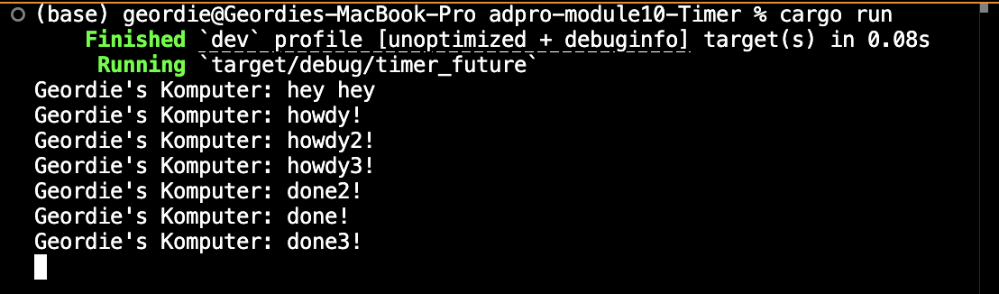
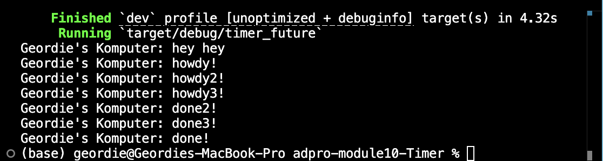
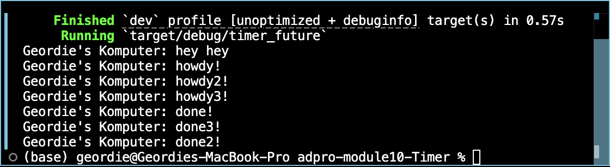

## Understanding How It Works

I injected a println! call right after spawner.spawn() so I could track the order of execution more precisely.

When I ran it, the very first line printed was:
Geordie's Komputer: hey hey
even though that println! sits after the spawn invocation in the code. That’s because spawning a task simply puts it on an executor’s queue—it doesn’t pause or await its completion. The main thread immediately moves on and executes the next statement, producing “hey hey” before the asynchronous task ever starts.

Sometime later, the spawned task finally kicks in. It logs:
Geordie's Komputer: howdy!
then pauses for two seconds via TimerFuture, and finally outputs:
Geordie's Komputer: done!
This sequence highlights how Rust’s futures run independently of the main thread: tasks are queued and executed in the background, allowing the main flow to continue without waiting.

## Testing Multiple Spawns
remove statement spawner

include statement spawner

Spawning multiple tasks enqueues each one for the executor to run cooperatively and asynchronously. By default, these tasks sit in the queue until the executor picks them up and drives them to completion.

Calling drop(spawner) signals to the executor that no further tasks will be added. In the first scenario—where drop(spawner) is commented out—the executor doesn’t know when it’s “done,” so it may exit early and leave some tasks unfinished. As a result, I might never see all of the “howdy!” and “done!” messages printed.

When I include drop(spawner), the executor recognizes that its work queue is final. It will continue running until every spawned task has finished, producing all of the “howdy!” and “done!” outputs in sequence. This illustrates how drop(spawner) is essential for cleanly shutting down the executor only after all asynchronous tasks have run to completion.